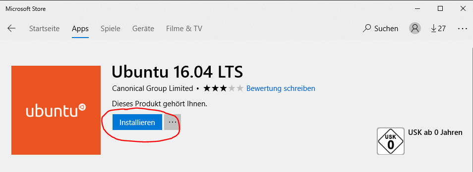
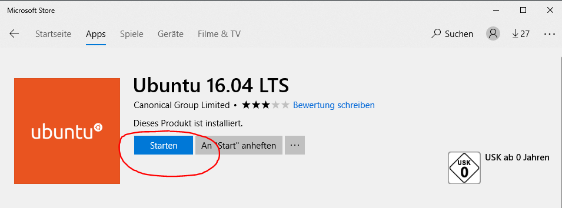
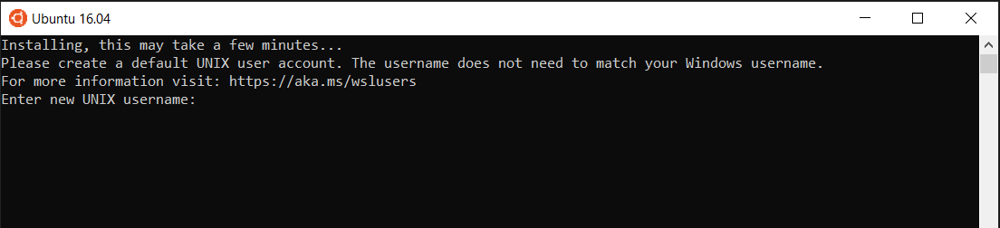

# Installing Windows Subsystem for Linux
## Preparing Windows for the installation
First of all the windows feature for the linux subsystem must be turned on.
Turn it on by running the following line in an elevated powershell:
```powershell
Enable-WindowsOptionalFeature -Online -FeatureName Microsoft-Windows-Subsystem-Linux
```
In the dialogue type `A` to enable the feature. Your PC will restart after this.
## Install your favourite linux distribution
Now you can open the Microsoft Store and install your favourite linux.
In this example we install Ubuntu 16.04 LTS. Open the Windows Store an search for
`Ubuntu`. Click on `Ubuntu 16.04 LTS`.



Hit `Install` to install the app on your computer. After it is installed you can start it by hitting `Start`.



After you have started Ubuntu it will take some time to prepare the installation.
A short time after that it will ask you for a username and password.



Instead of following that instruction hit `CTRL + C` to cancel the command.
Open a new powershell window and assure that you are in `<systemDrive>:/Users/<yourUser>`.
Then run the following command to set `root` as the default user:

```powershell
ubuntu1604.exe config --default-user root
```

After running that command linux will always start as root user:

